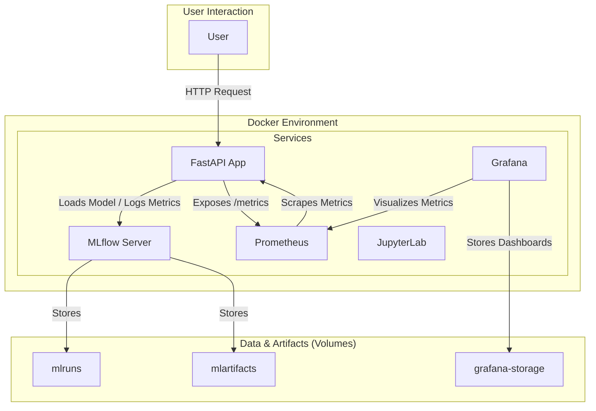
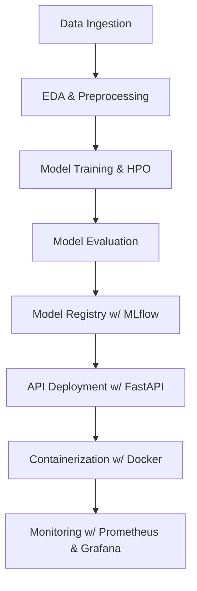

# Credit Risk Calculator API 🏦

[](https://github.com/your-username/credit_risk_calculator/actions/workflows/ci.yml)
[](https://opensource.org/licenses/MIT)

A comprehensive MLOps project for real-time credit risk assessment using a machine learning model, built with FastAPI and a modern Python stack.

---

## 📑 Table of Contents

1. [Features](#features)
2. [System Architecture](#system-architecture)
3. [MLOps Pipeline](#mlops-pipeline)
4. [Technology Stack](#technology-stack)
5. [Dataset](#dataset)
6. [Project Structure](#project-structure)
7. [Getting Started](#getting-started)
8. [Environment Variables](#environment-variables)
9. [How to Use](#how-to-use)
10. [Testing](#testing)
11. [Contributing](#contributing)
12. [License](#license)
13. [Acknowledgments](#acknowledgments)
14. [Contact](#contact)
15. [Documentation](#documentation)

---

## ✨ Features

- **🚀 REST API**: A high-performance, asynchronous API built with FastAPI for serving credit risk predictions.
- **🤖 Machine Learning**: Utilizes Scikit-learn and XGBoost for model training, with a complete preprocessing pipeline.
- **📊 MLflow Integration**: End-to-end experiment tracking, model versioning, and a model registry.
- **🐳 Dockerized Services**: Fully containerized application using Docker and Docker Compose for easy setup and deployment.
- **📈 Monitoring & Observability**: Integrated monitoring with Prometheus and Grafana for observing API performance and model metrics.
- **🧪 Testing**: Robust unit and integration tests using `pytest`.
- **📝 Documentation**: Interactive API documentation provided by Swagger UI.
- **⚙️ Configuration-driven**: Centralized configuration management using Pydantic.

---

## 🏗️ System Architecture

The system is designed as a set of interconnected services running in Docker containers.



---

##  MLOps Pipeline

The project follows a structured MLOps pipeline to ensure reproducibility and quality.



---

## 🛠️ Technology Stack

- **Backend**: FastAPI, Uvicorn
- **ML Frameworks**: Scikit-learn, XGBoost
- **Experiment Tracking**: MLflow
- **Containerization**: Docker, Docker Compose
- **Monitoring**: Prometheus, Grafana
- **Data Handling**: Pandas, Pydantic
- **Testing**: Pytest
- **Notebooks**: JupyterLab

---

## 📊 Dataset

This project leverages the public **[UCI German Credit Dataset](https://archive.ics.uci.edu/dataset/144/statlog+german+credit+data)** which contains 1,000 credit applications described by 20 attributes.

Key facts:

- **Source**: UCI Machine Learning Repository (Statlog German Credit Data).
- **Target variable**: `Risk` (good \(0\) or bad \(1\)).
- **Automatic download & caching**: The first time you run training or the API, `src/data_ingestion.py` will automatically download the raw data and create a cleaned version at `data/german_credit_data.csv`—no manual steps required.
- **License**: The dataset is provided for academic purposes; see the [UCI terms of use](https://archive-beta.ics.uci.edu/terms) for details.
- **Pre-processing**: Numerical scaling, categorical encoding (one-hot), and class balancing are handled inside the ML pipeline defined in `src/pipeline.py`.

---

## 📄 Project Structure

```
credit_risk_calculator/
├── data/                     # Raw and processed data
├── docs/                     # Project documentation
├── models/                   # Fallback trained models (e.g., .joblib)
├── monitoring/               # Prometheus and Grafana configs
├── notebooks/                # Jupyter notebooks for EDA and experimentation
├── scripts/                  # Helper scripts (e.g., data preparation)
├── src/                      # Source code for the application
│   ├── config.py             # Configuration management
│   ├── data_ingestion.py     # Data loading scripts
│   ├── hpo.py                # Hyperparameter optimization
│   ├── logging_config.py     # Logging setup
│   ├── observability.py      # Monitoring and tracing setup
│   ├── pipeline.py           # ML preprocessing pipeline
│   ├── train.py              # Model training script
│   └── utils.py              # Utility functions
├── tests/                    # Unit and integration tests
├── .env.example              # Example environment variables
├── docker-compose.yml        # Docker Compose for all services
├── Dockerfile                # Dockerfile for the main API application
├── jupyter.Dockerfile        # Dockerfile for the JupyterLab service
├── main.py                   # FastAPI application entry point
├── pyproject.toml            # Project metadata and dependencies (PEP 621)
└── README.md                 # This file
```

---

## 🚀 Getting Started

### Prerequisites

- [Docker](https://www.docker.com/get-started) and Docker Compose
- Git
- A terminal or command prompt

### Installation & Usage

This project is designed to be run with Docker Compose, which simplifies the setup of all services.

**1. Clone the Repository**

```bash
git clone https://github.com/your-username/credit_risk_calculator.git
cd credit_risk_calculator
```

**2. Configure Environment Variables**

Create a `.env` file from the example. No changes are needed for default local setup.

```bash
cp env.example .env
```

**3. Run with Docker Compose**

This single command builds the images and starts all the services defined in `docker-compose.yml`.

To run the main application (API, MLflow, Jupyter):

```bash
docker-compose up --build
```

To include the optional monitoring stack (Prometheus, Grafana):

```bash
docker-compose --profile monitoring up --build
```

The services will be available at the following ports:

- **Credit Risk API**: `http://localhost:8001`
- **MLflow UI**: `http://localhost:5001`
- **JupyterLab**: `http://localhost:8888`
- **Prometheus**: `http://localhost:9090` (if `monitoring` profile is active)
- **Grafana**: `http://localhost:3000` (if `monitoring` profile is active)

---

## 🔧 Environment Variables

The application is fully configurable via environment variables or a `.env` file. The most common options are listed below together with their default values.

| Variable | Default | Description |
|----------|---------|-------------|
| `MLFLOW_TRACKING_URI` | `http://mlflow:5000` | MLflow tracking server URL used by the API & training scripts |
| `MLFLOW_MODEL_NAME` | `credit_risk_model` | Registered model name to load from the MLflow Model Registry |
| `MODEL_URI` | `models:/credit_risk_model/Production` | Explicit MLflow model URI (overrides `MLFLOW_MODEL_NAME`) |
| `FALLBACK_MODEL_PATH` | `models/logistic_regression_model.joblib` | Local path to a joblib-serialized model used if MLflow is unavailable |
| `API_KEYS` | *(empty)* | Comma-separated list of valid API keys for the `/predict` endpoint. If empty, authentication is disabled |
| `LOG_LEVEL` | `INFO` | Logging verbosity for both training scripts and the API |

> ℹ️ **Tip:** In development you can simply copy `env.example` to `.env` and keep the defaults.

---

## 🕹️ How to Use

### 1. Train a Model (Optional)

You can train new models using the `train.py` script or the provided Jupyter notebook. The easiest way is to use the running JupyterLab service.

- Navigate to `http://localhost:8888`.
- Open a terminal within JupyterLab.
- Run the training script:
  ```bash
  python src/train.py --model-type logistic_regression
  ```
  This will register a new model version in the MLflow server running at `http://mlflow:5000` (from within the Docker network).

### 2. Interact with the API

The API provides interactive documentation (Swagger UI).

- **API Docs**: [http://localhost:8001/docs](http://localhost:8001/docs)

You can use the docs to send test requests or use a tool like `curl`.

**Example `curl` Request:**

```bash
curl -X 'POST' \
  'http://localhost:8001/predict' \
  -H 'accept: application/json' \
  -H 'Content-Type: application/json' \
  -d '{
    "Duration": 12,
    "Credit_amount": 5000,
    "Age": 35,
    "Installment_rate": 3,
    "Present_residence": 2,
    "Existing_credits": 1,
    "Dependents": 1,
    "Checking_account": "A11",
    "Credit_history": "A34",
    "Purpose": "A43",
    "Savings_account": "A61",
    "Employment": "A73",
    "Personal_status_sex": "A93",
    "Other_debtors": "A101",
    "Property": "A121",
    "Other_installment_plans": "A143",
    "Housing": "A152",
    "Job": "A173",
    "Telephone": "A192",
    "Foreign_worker": "A201"
  }'
```

### 3. Monitor the Application

If you started the `monitoring` profile:

- **Grafana**: Navigate to `http://localhost:3000`.
  - Login with `admin` / `admin`.
  - You can add Prometheus as a data source (`http://prometheus:9090`) and build dashboards to visualize metrics like `fastapi_requests_total` and `model_prediction_confidence`.
- **Prometheus**: View raw metrics and targets at `http://localhost:9090`.

---

## 🧪 Testing

Tests are written with `pytest`. You can run them inside the `credit-risk-api` container.

1. Find the container ID:
   ```bash
   docker ps
   ```

2. Execute `pytest` inside the container:
   ```bash
   docker exec -it <container_id_of_credit-risk-api> pytest
   ```

---

## 🤝 Contributing

Contributions are welcome! Please feel free to submit a pull request.

1.  Fork the repository.
2.  Create a new feature branch (`git checkout -b feature/your-feature`).
3.  Commit your changes (`git commit -m 'Add some feature'`).
4.  Push to the branch (`git push origin feature/your-feature`).
5.  Open a pull request.

---

## 📄 License

This project is licensed under the MIT License. See the [LICENSE](LICENSE) file for details.

## 🙏 Acknowledgments

- UCI Machine Learning Repository for the German Credit Dataset
- FastAPI team for the excellent web framework
- MLflow team for experiment tracking capabilities
- Scikit-learn and XGBoost communities

## 📧 Contact

- GitHub: [Your GitHub Profile]
- LinkedIn: [Your LinkedIn Profile]
- Email: [Your Email]

## 📚 Documentation

Full documentation (architecture, Python reference, ADRs) is available via MkDocs:

```bash
# Serve locally
pip install mkdocs-material mkdocstrings[python]
mkdocs serve
```

Deployed site: https://example.com/docs

---

**Made with ❤️ for the ML community** 