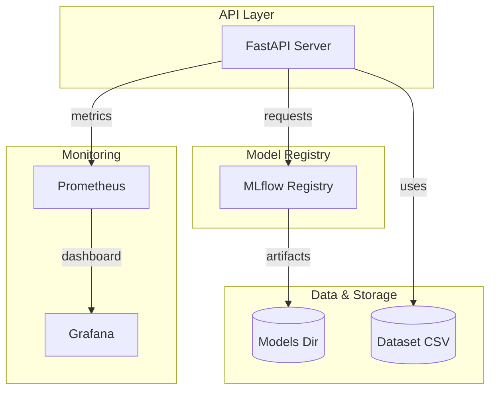

# System Architecture

The platform adheres to a micro-ML-service style. The API layer serves predictions and orchestrates data flows; MLflow manages experiment tracking and model versioning; Prometheus & Grafana provide observability. 