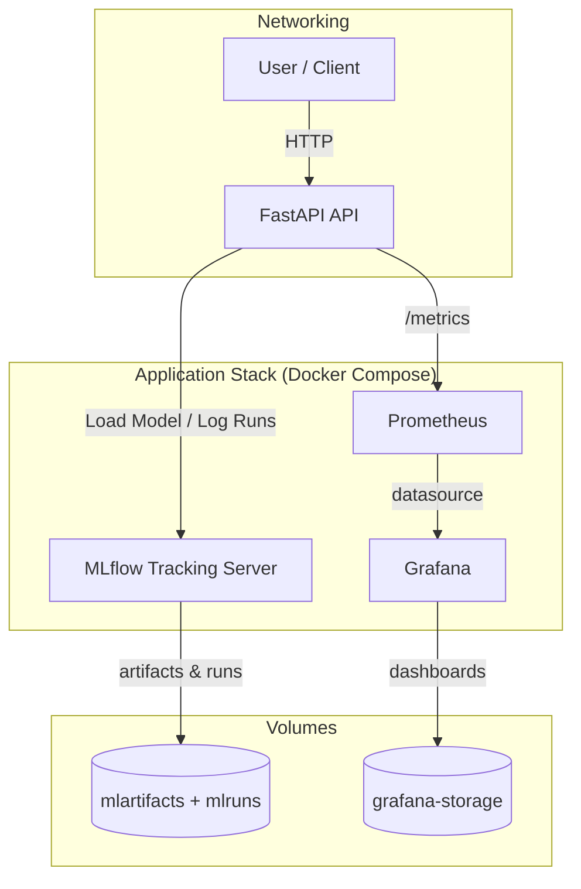

# System Architecture 🏗️

Below is a high-level overview of how the components of **Credit Risk Calculator** interact in a typical local deployment (via Docker Compose).

### Component Roles

| Component | Purpose |
|-----------|---------|
| **FastAPI App** | Serves the `/predict`, `/health`, and `/metrics` endpoints. Loads the latest model from MLflow or a local fallback at startup. |
| **MLflow Server** | Central registry for experiments, runs, and model versions. |
| **Prometheus** | Scrapes metrics from the API (e.g., request latency). Enabled via the `monitoring` profile. |
| **Grafana** | Dashboards and visualization layer powered by Prometheus data. |
| **Volumes** | Persist artifacts, runs, and dashboard data between container restarts. |

### Data & Model Flow

1. A client sends a JSON payload to `/predict`.
2. The FastAPI application validates the request with Pydantic and feeds features into the loaded model.
3. Prediction results (class & probability) are returned to the client.
4. The API exposes performance metrics (request count, latency, model confidence) at `/metrics`.
5. Prometheus scrapes these metrics; Grafana visualizes them.
6. New models trained via `src/train.py` are logged to MLflow and can be promoted to **Production** for the API to pick up automatically.

> Looking for more details? Check out the [ADR 0001](../adr/0001-record-architecture-decision.md) for reasoning behind key architectural decisions. 